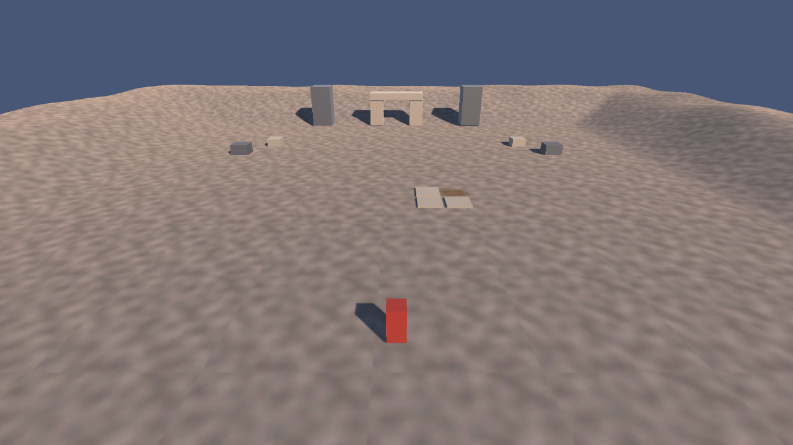

# El atrio incompleto de Cantuña

Escena sencilla de Unity 6 inspirada en la leyenda quiteña de Cantuña. El jugador recorre un atrio en construcción; tres losas señalan la cuarta piedra ausente. Los cubos representan la fachada y los bloques que aún quedan por colocar.

La escena fue diseñada para practicar **Terrain, topografía, Terrain Layers, materiales, jerarquías, cubos, cámara, luces y movimiento básico**, siguiendo los tres tutoriales de clase.

## Requisitos

- Unity Editor **6000.6.2f1** (Unity 6), instalado mediante Unity Hub.
- Un ordenador capaz de abrir un proyecto 3D de Unity.

El proyecto usa los recursos incluidos en Unity. Las tres texturas del terreno se guardan en `Assets/Textures`; no requiere descargas de Asset Store.

## Abrir y recorrer la escena

1. Clona o descarga este repositorio.
2. En Unity Hub, elige **Add project from disk** y selecciona la carpeta que contiene este README.
3. Abre el proyecto con Unity 6000.6.2f1 y espera a que termine la importación inicial.
4. En **Project**, abre `Assets/Scenes/AtrioIncompleto.unity`.
5. Pulsa **Play**, haz clic en la vista **Game** y usa **W/S** para avanzar o retroceder y **A/D** para girar. Pulsa Play de nuevo para detener la prueba.

El movimiento usa el Input Manager clásico, como en el tercer video. Si Unity informa que este sistema está desactivado, abre **Edit → Project Settings → Player → Active Input Handling**, selecciona **Both** y acepta el reinicio.

## Qué contiene

| Elemento | Función |
| --- | --- |
| Terrain 100 × 100 m | Plaza plana en el centro y pequeñas laderas esculpidas en los bordes. |
| 3 Terrain Layers | Piedra para el atrio, tierra de obra y pasto de ladera. |
| 5 cubos de fachada | Dos torres y tres piezas que forman la entrada. |
| 4 cubos de construcción | Bloques laterales que hacen reconocible la obra sin cerrar el recorrido. |
| 3 cubos de losa | Dejan visible una cuarta posición vacía. |
| Jugador | Cubo rojo con `CharacterController` y `PlayerController`; la cámara es hija del jugador. |
| Luz | Una `Directional Light` de tono cálido sugiere el amanecer. |

Hay **12 cubos de entorno** claramente agrupados en la jerarquía, además del cubo del personaje. La posición vacía se representa con tierra pintada al ras del terreno.

## Estructura del proyecto

- `Assets/Scenes/AtrioIncompleto.unity`: escena lista para abrir.
- `Assets/Terrain/`: TerrainData y Terrain Layers editables.
- `Assets/Textures/` y `Assets/Materials/`: recursos usados por la escena.
- `Assets/Scripts/PlayerController.cs`: movimiento y gravedad del jugador.
- `Assets/Editor/CantunaSceneBuilder.cs`: procedimiento con el que se creó y verificó la escena. También añade el menú **Herramientas → Cantuña → Verificar escena**.
- `Docs/VistaJuego.png`: vista previa de la escena desde la cámara del jugador.

## Referencia cultural

La escena es una interpretación sencilla del pacto y del atrio inconcluso de la [leyenda de Cantuña](https://www.cancilleria.gob.ec/turquia/wp-content/uploads/sites/98/2021/09/Leyendas-Populares-Ecuador-vFinal.pdf). La silueta de dos torres se inspira en la [fachada de San Francisco de Quito](https://museosanfranciscodequito.com/arquitectura/); no busca reconstruir el monumento con precisión histórica.
